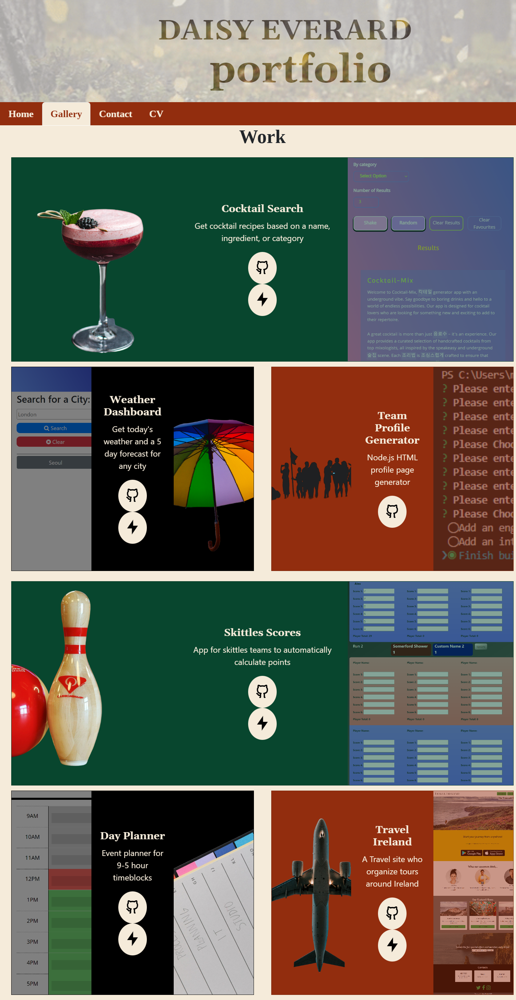

# React Portfolio 
  
## Description

A React app to collate and present my body of work and introduce myself

## Link to site

https://daisyeverard.github.io/React-Portfolio/

## Preview

## Table of Contents

- [Installation:](#installation) how to install this app and its dependencies
- [Usage:](#usage) How this app is used
- [Tech:](#tech) Which technologies were used in creating the app
- [Questions:](#questions) Contact information to send your questions and feeback to

## Installation

To install this project: 
  
  - Clone the repository to your computer
  - open a terminal and run `npm install`
  - a list of dependencies can be found in `package.json`
  
## Usage

You will initially land on the home page. You can navigate between pages (home, gallery, contact, and CV) using the navbar.

If you want to know more about a project in the gallery, click on the GitHub logo to go to the repository, or the lightning symbol to go to the live site. Some projects, such as node.js projects will not have a live site. 

In the contact section you can click the GitHub and LinkedIn logos to be taken to my profiles. There is a contact form underneath this to send me some questions.

The CV section has a `CV PDF` button which can be clicked to view a pdf version of my CV.

## Tech

- HTML
- CSS
- Bootstrap
- Remix Icons
- Google Fonts
- Javascript
- JSX
- React
  
## Questions

If you have any questions or feedback about this team profile generator, please get in contact with me at:
  - GitHub: [https://github.com/daisyeverard](https://github.com/daisyeverard) ;
  - LinkedIn: [https://www.linkedin.com/in/daisy-everard/](https://www.linkedin.com/in/daisy-everard/) 
  - Email: msdeverard@gmail.com
  
## Credits

Photos from unsplash.com
Fonts from Google Fonts
Button icons from remixicon.com
Gifs from giphy.com

## License

MIT License
